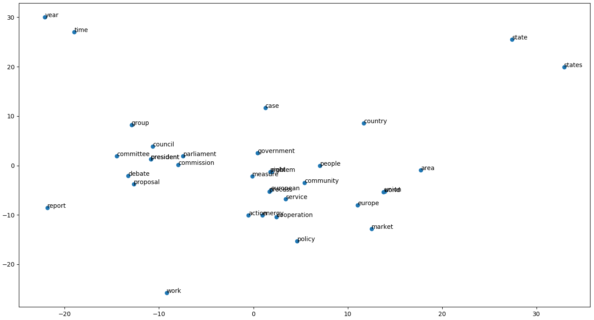

# Sense Embeddings

The goal of this project is to construct and train the fastText algorithm to create a word embedding based on the paper 'Enriching Word Vectors with Subword Information', which was developed by Facebook's AI Research (FAIR) lab.

The dataset used for the training was the [EuroSense dataset](http://lcl.uniroma1.it/eurosense/), which is a multilingual sense-annotated resource in 21 languages, however only the English language was used for this task.

For the correlation evaluation, the dataset [WordSimilarity-353](http://www.cs.technion.ac.il/~gabr/resources/data/wordsim353/) is used.

The training was done using a Google Compute Engine instance running a Tesla K80 GPU.

 
<i>Dimensionality reduction of 40 words with the highest number of samples</i>

## Instructions

* Generate dictionary

`python preprocess.py [resource_folder] [file_name]`

* Train

`python train.py [file_name]`

* Score

`python train.py [resource_folder] [gold_file] [model_name]`

* Plot PCA

`python pca.py [resource_folder] [filtered_vec_name]`
